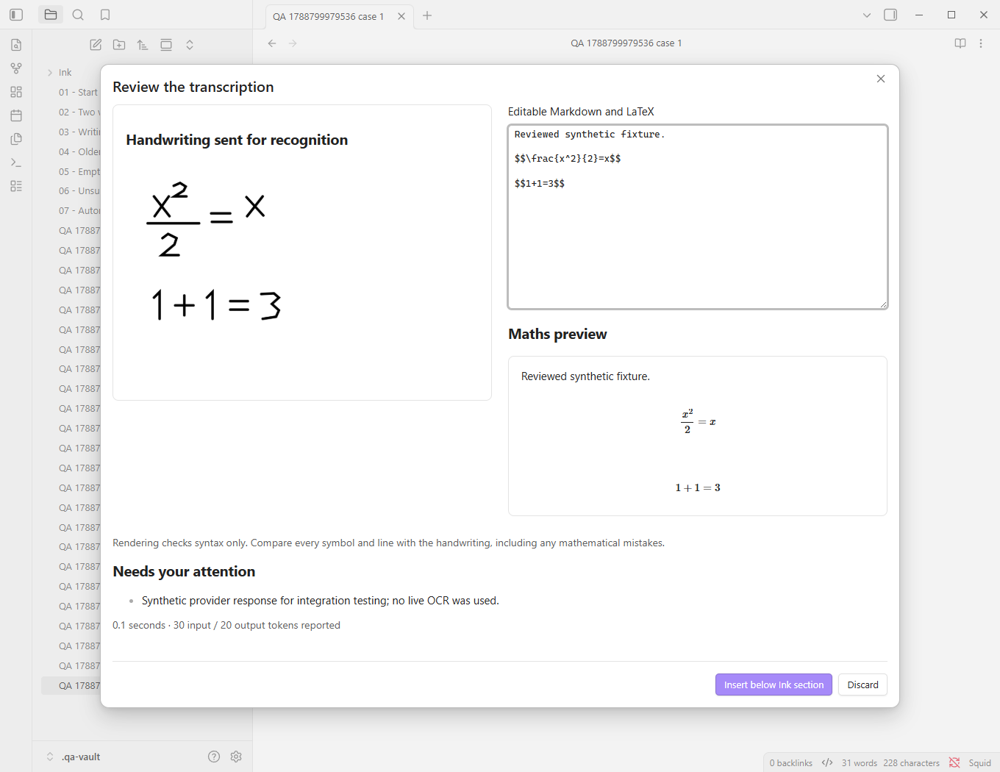

# Squid

Turn handwritten [Ink](https://github.com/daledesilva/obsidian_ink) sections into editable Markdown and LaTeX in Obsidian:

**Write in Ink → choose a section → inspect the image → transcribe → review and edit → insert underneath.**

Squid is an independent TypeScript companion plugin. It transcribes what is on the page, including incorrect mathematics; solving and correcting are outside this workflow.

**Status:** implementation candidate for a Windows personal beta. Automated checks and an actual Obsidian smoke test pass. Recognition accuracy and time savings on the owner's handwriting are **not yet measured**. No live OpenAI calls were made during implementation.



The screenshot is a software integration demonstration, not an OCR accuracy result.

## Install

Requirements: **desktop Obsidian 1.11.4+**, SVG-based Ink notes, and an OpenAI API key for paid transcription. Windows is the first supported test platform. The plugin needs no server, Python installation, or Node installation at runtime.

1. Download a `squid-plugin` artifact from a successful repository [Actions run](https://github.com/Kxnar/ink-ocr/actions), or build locally below.
2. Copy `main.js`, `manifest.json`, and `styles.css` into `<vault>/.obsidian/plugins/squid/`.
3. Reload Obsidian, enable community plugins for that vault, and enable **Squid**.
4. Open **Settings → Squid → OpenAI API key**. Choose or create a secret in Obsidian SecretStorage. Squid saves the secret's name, never the key itself, in its settings.
5. Review the evaluation allowance and conversion rate. Defaults are **£10 total**, **£0.50 per request reserved**, and **£1 per US dollar as a planning allowance**, not a live exchange rate. Include relevant taxes, fees and other evaluation spending.

An API account with funded access is required. A ChatGPT subscription alone does not supply API credit. Do not paste an API key into a note, repository, issue, screenshot, or chat.

## Use

1. Save/exit the Ink editor so its SVG reflects your current handwriting.
2. Put the cursor on the Ink embed line in a Markdown note's **editing mode**.
3. Run **Squid: Transcribe Ink section**. Elsewhere in the note, the command offers a section picker.
4. Inspect the exact white-background recognition image. Use percentage crop controls and **Update crop preview** if necessary. Oversized inputs show an overview and cannot be sent until cropped; Squid does not silently shrink the recognition image below one pixel per SVG unit.
5. Choose **GPT-5.6 Sol** or **GPT-5.6 Luna**, then click **Send image to OpenAI**.
6. Compare the image with the editable result and maths preview. Check omissions, faint symbols, and mathematical mistakes the model may have corrected. Rendering is a syntax check, not an accuracy check.
7. Click **Insert below Ink section**, or explicitly replace a previously reviewed transcript. Existing manual edits require the **Replace my edited transcript** toggle. Edits made after review opened require opening a fresh review.

The reviewed result is ordinary Markdown with `$…$` and `$$…$$` mathematics. It remains readable and editable with Squid disabled. The original Ink attachment is retained.

Other commands:

- **Check Ink transcript status**: reports outdated handwriting, manual edits, missing sources, and ambiguous pair IDs. The status bar also counts outdated sections in the active note.
- **Give copied Ink pair a new ID**: select the copied embed to separate it from its original, including copies within the same note. The copied text is protected as manually edited.
- **Cancel transcription**: invalidates the active result. A submitted request may still be charged.

Move the **complete marker/embed/transcript block** together. Squid searches for the pair again before applying instead of trusting old line numbers. If there is more than one copy of an ID, it refuses to choose a destination.

## Build and check

Use Node.js 22+ for development only:

```powershell
npm ci
npm run check
npm run package
```

Installable files are in `dist/squid/`; `dist/SHA256SUMS.txt` records their hashes. `npm run dev` rebuilds on source changes.

Create a disposable test vault, then open that folder with Obsidian:

```powershell
npm run qa:vault
```

The vault is `.qa-vault/`. Existing notes are preserved when the command refreshes the plugin build. Its fixtures are independently created synthetic strokes; they do not constitute a handwriting benchmark. The older-metadata fixture is visual-only and is not a complete editable tldraw document.

For automated testing against an installed Windows Obsidian application:

```powershell
npm run qa:obsidian
```

This launches a separate `.qa-profile/` against `.qa-vault/`, uses a mock recognition provider, and saves screenshots in `.qa-artifacts/`. It checks the vault path before making changes. Set `OBSIDIAN_EXE` if Obsidian is not installed at `C:\Program Files\Obsidian\Obsidian.exe`. The test harness uses app internals to arrange test state; the shipped plugin integrates through public APIs.

## Privacy, costs, and limits

- Only the selected PNG and fixed transcription instructions are sent to OpenAI. No note text, attachment metadata, vault path, transcript history, or tool access is included. Requests set `store: false`. Standard provider retention may still apply.
- Recent result caching is local, optional, and limited to 20 transcripts. It contains recognised text and usage, so vault backups/sync may include it. Clear or disable it in settings. Images are only saved locally when you explicitly click **Save prepared PNG**.
- Comparison records and the spending ledger live in Squid's plugin `data.json`, outside Ink SVGs. There is no telemetry, automatic transcription, retry loop, or background batch processing.
- The local £10 guard admits requests using a reserved allowance and charges it against returned token usage. It is an **estimate and admission guard, not a provider billing cap**. Unknown charges retain their allowance until you reconcile them. Check actual billing, rates, tax and funding requirements before spending.
- One request runs at a time. Timeouts, cancellation, source changes, plugin disable, malformed data, refusal, and truncated output never apply a transcript automatically.
- Current Ink SVGs and self-contained vector SVGs with older tldraw metadata are supported. Legacy `.writing`/`.drawing` files and code blocks require Ink migration. Unsupported SVG features are rejected visibly. See [compatibility](docs/compatibility.md).
- Automatic transcription, other providers, local-model execution, batch plugin commands, and TikZ conversion remain later milestones.

## Evaluation and delivery notes

- [Handwriting benchmark instructions](benchmark/README.md) — 60 actual sections, 40 development / 20 held-out, conservative formula matching, review timing, and costs.
- [Acceptance checklist and measured status](docs/acceptance.md) — separates automated software tests from unfinished personal-beta evaluation.
- [Short demonstration](docs/demo.md) — the workflow with synthetic input and a mock response.
- [Architecture and source references](docs/architecture.md) — pairing, asynchronous writes, provider boundary, and upstream integration references.

No Ink implementation code or upstream artwork is bundled. Squid reads its saved format through independently written companion code.
