# Architecture

Squid owns the transcription workflow and never writes into Ink attachments.

```mermaid
flowchart LR
  Note[Markdown embed] --> Resolve[Obsidian link resolver]
  Resolve --> SVG[Saved Ink SVG]
  SVG --> Prepare[Detached XML validation and PNG rasterisation]
  Prepare --> Preview[Exact image and crop review]
  Preview --> Cache[Local content cache]
  Cache --> Provider[OpenAI Responses API]
  Provider --> Review[Editable transcript and maths preview]
  Review --> Guard[Re-find ID and compare live source and body]
  Guard --> Transaction[One editor transaction]
  Transaction --> Note
```



## Boundaries

- `src/ink/`: standalone embed parsing, viewport validation, SVG preparation, and bounded canvas rendering. Metadata is removed before rasterisation. The selected pixels are the only source input for recognition.
- `src/notes/pairs.ts`: pure offset-preserving pairing and edit construction. Duplicates and detached markers are errors, including copies across notes. Re-keying a specifically selected local copy is an explicit command.
- `src/recognition/`: small provider interface, fixed versioned faithful-transcription prompt, strict Responses output validation, single-flight lifecycle, caching, and spending reservations. Desktop HTTPS has a fixed endpoint, no redirects, no retries, and a two-minute deadline.
- `src/ui/`: native Obsidian controls. Prose preview uses text nodes; maths uses Obsidian's MathJax loader/renderer. Preview never invokes arbitrary Markdown postprocessors. Insertion rejects executable code fences, active HTML resources, image embeds, and reserved markers.
- `src/main.ts`: public vault, metadata-cache, workspace, editor, SecretStorage, command, modal, and plugin-data APIs. Reads open editors preferentially and refuses disagreement between duplicate views.
- `src/evaluation/` and `scripts/benchmark.ts`: a separate explicitly invoked developer evaluation harness. It is not shipped as automatic plugin batch processing.

## Pair format

```markdown
<!-- squid:source 12345678-1234-4321-8321-123456789abc -->
  [Edit Writing](https://youtu.be/2arL1jh8ihA?type=inkWriting)

<!-- squid:transcript 12345678-1234-4321-8321-123456789abc -->
Reviewed prose with $x_i$.

$$
1+1=3
$$
<!-- squid:end 12345678-1234-4321-8321-123456789abc -->
```

A source ID is anchored with an Undo-able transaction when opening the workflow. Cancelling may leave that harmless source comment; no transcript is inserted. Applied records store the source revision, generated and applied content hashes, model, prompt version, crop, and timestamp in plugin data. Pair IDs, not stored note paths, identify destinations.

The source revision hashes the full saved SVG, kind and embed viewport. Link spelling is excluded so renaming a file does not automatically make an unchanged source outdated. Cache keys additionally include the prepared PNG hash and crop, dimensions, model, prompt version, and output-token cap.

Before insertion, Squid scans Markdown notes and current editor buffers, resolves exactly one pair, re-reads the SVG, compares the source and reviewed body, and checks the editor again immediately before its transaction. Vault/editor changes during an asynchronous final check reject the action for retry. Manual replacement permission does not override a body change made after that review opened.

## Usage and cancellation

A request allowance is persisted before a billable call. Provider-reported token usage is recorded even for subsequently rejected/incomplete output. A timeout, interrupted connection, or cancellation without usage leaves an unknown charge reserved. Pricing is a dated estimate; provider billing remains authoritative. Failed saves prevent starting a request.

Abort invalidates the local result and closes the local connection. It cannot promise that the provider stops processing or charging. Disabling Squid aborts any session. There is no route from a late provider response directly to a note write: every successful result must pass a fresh review and destination check.

## References checked on 7 September 2026

These sources describe integration contracts; Squid does not copy Ink's implementation:

- [Ink file format and conversion](https://github.com/daledesilva/obsidian_ink/blob/eba2b1200d9db1b64edb86d0ed6b90cfaa45f267/docs/file-format-and-conversion.md)
- [Ink embed format](https://github.com/daledesilva/obsidian_ink/blob/eba2b1200d9db1b64edb86d0ed6b90cfaa45f267/src/components/formats/current/utils/build-embeds.ts)
- [Ink SVG export](https://github.com/daledesilva/obsidian_ink/blob/eba2b1200d9db1b64edb86d0ed6b90cfaa45f267/src/ink-canvas/svg-export.ts)
- [Ink drawing preview viewport handling](https://github.com/daledesilva/obsidian_ink/blob/eba2b1200d9db1b64edb86d0ed6b90cfaa45f267/src/components/formats/current/drawing/drawing-embed-preview/drawing-embed-preview.tsx)
- [Obsidian SecretStorage guide](https://docs.obsidian.md/plugins/guides/secret-storage)
- [OpenAI structured outputs](https://developers.openai.com/api/docs/guides/structured-outputs)
- [GPT-5.6 Sol](https://developers.openai.com/api/docs/models/gpt-5.6-sol) and [GPT-5.6 Luna](https://developers.openai.com/api/docs/models/gpt-5.6-luna)

No live model ranking, rate, or handwriting accuracy is inferred from these documentation checks.
