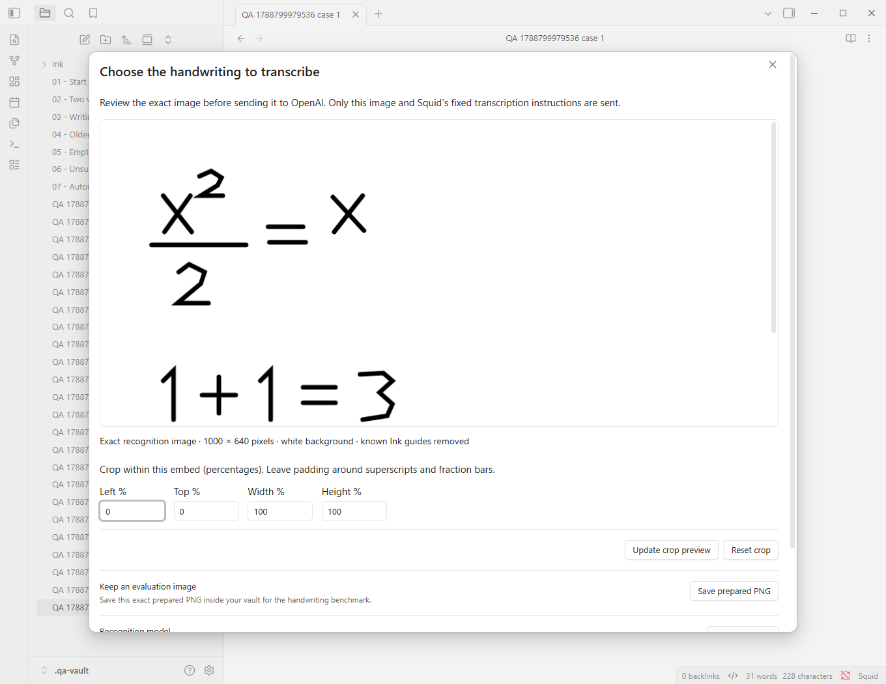

# Short workflow demonstration

This demonstration uses independently created synthetic strokes and a mock recognition response inside real Obsidian. It makes **no paid API call** and does not establish OCR accuracy.

1. Open a note, put the cursor on its Ink section, and run **Squid: Transcribe Ink section**.
2. Inspect the selected viewport. The grey writing guides disappear; the handwritten fraction bar and superscript remain. Large sections require cropping before the Send button enables.



3. Send the image. The mock returns LaTeX; the live plugin sends the exact previewed PNG to the selected OpenAI model.
4. Edit the transcript beside the original image. The deliberately false `1+1=3` is preserved in this demonstration. Rendering that expression successfully does not make it mathematically true or prove transcription fidelity.


5. Insert the reviewed text immediately beneath its source. It is ordinary editable Markdown. Undo reverts the insertion. Later manual corrections are protected when regenerating.

To reproduce with the local mock and capture current screenshots:

```powershell
npm run build
npm run qa:vault
npm run qa:obsidian
```

To try actual handwriting recognition, open `.qa-vault/` manually, write/save a real Ink section, configure your own OpenAI secret, and follow the same review steps. The automated mock test clears its fake key reference before finishing.
